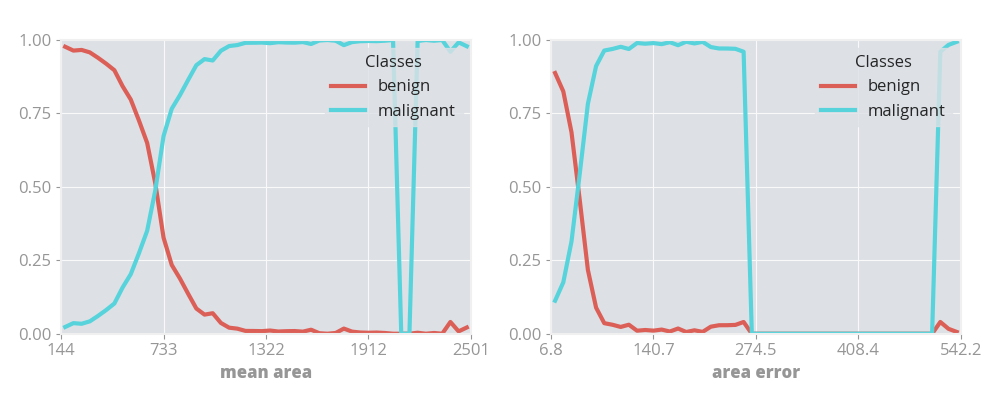

# LDR

[](eliaskassell.com)
[](https://github.com/ekrekr/ldr/issues)
[](https://github.com/ekrekr/ldr/pulls)
[](https://www.gnu.org/licenses/gpl-3.0)

LDR stands for **Latent Dimensionality Reduction**. It is a generic method for interpreting models. It is deployed [here](https://pypi.org/project/ldr/) as a python module.

## About

The purpose of LDR is to solve a common and [controversial](https://arxiv.org/abs/1811.10154) problem. Often models that have a higher predictive accuracy are more complex. These complex models are sensibly referred to as **black box models**. This is frustrating for many data scientists, as they end up with a model that performs well, but **can't explain why**. Inability to explain the model frequently causes the model to **fail in critical situations**, that are difficult to test for.

LDR aims to bridge that gap by providing a generic, reliable algorithmic method for interpreting most models. I define interpretability as:

1. Understanding the quality of a systems current understanding. Is the model overfitting, is there insufficient training data, and thus will it fail when deployed to the real world?

2. Interpreting how the value of a feature, or subset of features, affects a model's prediction (which I refer to here as **feature interpretation**).

3. The ability to use a model when not all values for the input features are present.

## Getting Started

### Prerequesites

[Python3](https://www.python.org/download/releases/3.0/).

Some examples contain additional that are not installed as dependencies by default, such as [PyTorch](https://pytorch.org).

### Installation

```console
python3 -m pip install ldr --user
```

### Examples

<!-- An example analysis of a simple generated distribution can be found [here](examples/distribution_example.ipynb). -->

An example analysis of a classification problem can be found [here](examples/classification.py).

<!-- An example analysis of a classification problem, using a neural network, can be found [here](examples/classification_example.ipynb). -->

<!-- An example analysis of a regression problem can be found [here](examples/regression_example.ipynb). -->

### Explanation

The examples above generate either 1D or 2D visualizations. These demonstrate the certainty of the model across the sample space it is trained on. Take these 1D visualizations for example, which describe the **model's certainty of malignancy classification of mean area and area error of breast cancer** samples in a [study](<https://archive.ics.uci.edu/ml/datasets/Breast+Cancer+Wisconsin+(Diagnostic)>).

#### 1 Dimensional Visualization



Here what can be seen is that if a cancer has a **mean area of less than 250** then the model is most likely to **classify it as benign**, whereas if it has a **mean area of more than 1200** then it is almost certainly going to be **classified as malignant**.

With the area error, what can be seen is that **between 280 and 480**, there is **not enough training data** for the model to reliably make a prediction in that area, as the total model certainty drops to 0 for both classifications. **Between 80 and 210** the model is very biased towards a **malignant classification**.

#### 2 Dimensional Visualization


#### How Model Certainty is Calculated

#### Why Naive Regression Sucks

## Additional Notes

If you find this package useful, please consider [contributing](contributing.md)!

Examples
How To
Technical
Explanation
